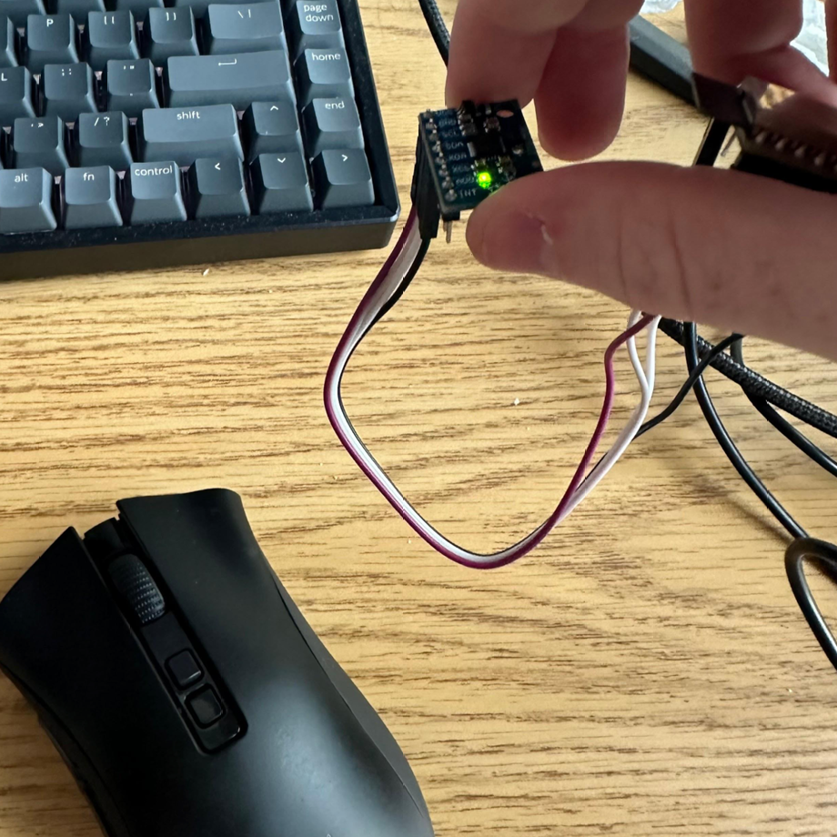

# SVM Classification of accleration and angular velocity data in real time

This repository contains code for real time prediction of gesture based on acceleration and angular velocity data IMU sensor connected to an ESP32S3. An SVM model is trained on CSV files containing this data for left right up and down motions.

- main.c: build and flash to ESP32S3 to output x, y, z acceleration and gyroscope data as well as temperature to monitor
- get_data_2.py: listens to output from ESP32S3 and outputs to csv files. 
- analyze_data.ipynb: analysis code for IMU data. 
- SVM.ipynb: SVM classification code
- classify.py: real time classification code
- data: all data used in analysis
- media: photos and videos for demonstration purposes

# Demonstration Video: 
https://drive.google.com/file/d/1qBjUpJ15PfrAvJ2Cbs6AHv5MUKJ_K3Lv/view?usp=drive_link

# Setup Picture:

# Assignment Report

# Gathering Data

To gather data, I restructured my code into a new python file, get_data_2.py, which ensures data is only collected when motion is detected. This is done to standardize where motion occurs within the recording, utilizing the same time window as during classification

# SVM Classification

2 SVM models were trained, one with a test fold of 20% and one without any data left out for testing. This was done to maximize the amount of data utilized during real time classification. Below is the confusion matrix for the first model, achieving an accuracy of 100%

# Real time classification

Real time classification appeared very inconsistent with left and right gestures, but consistently accurate for up and down gestures. Left and right gestures almost always were also classified as up. 

